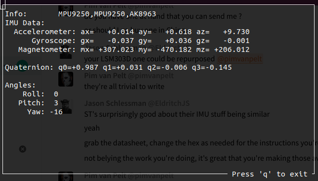
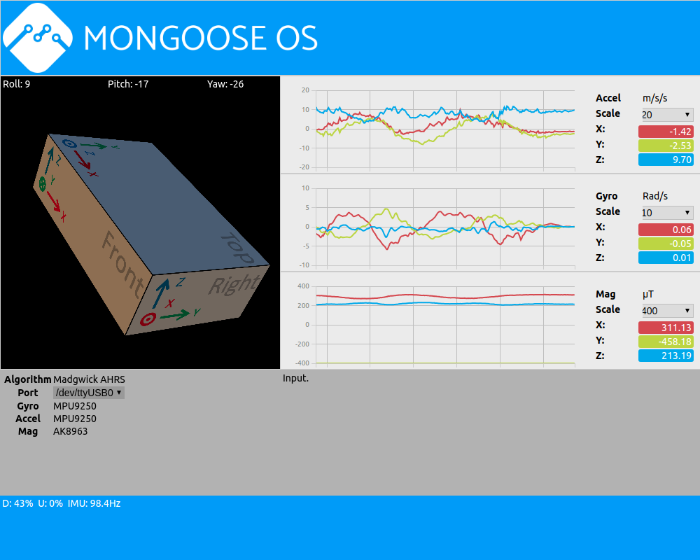

# Mongoose IMU Demo

This is a set of apps that demonstrate the [Mongoose IMU](https://github.com/mongoose-os-libs/imu)
library. This IMU library supports lots of gyroscope, accelerometer and
magnetometer sensors commonly found on the market today.

## Demo Apps

### Mongoose OS

The primary component is a Mongoose OS application (currently for ESP32) that
interfaces the IMU library and emits binary packets over serial console (which
is why `mos console` won't do much but print out garbage). The sensors are
initialized and a Madgwick AHRS (attitude and heading reference system) is
started with an update frequency of 100Hz. The AHRS serves to fuse the data
from individual sensors:

*   Accelerometer: measures the acceleration of the device in three directions,
typically `X`, `Y`, and `Z` axes that are perpendicular to one another. One of
these, typically `Z`, is being pulled towards earth and therefore measures 
grativy. Most accelerometers will have a range of between 2G and 16G.
*   Gyroscope: measures the angular rate, also in three axes. Most gyro's will
have a range of between 250deg/sec and 2000deg/sec.
*   Magnetometers: measures the earth's magnetic field through the device,
also in three directions.

These sensors yield 9 values, which can be combined by an AHRS into a stable
representation of the device's position in 3D space.

### Console application

There's a simple console application based on `ncurses` which reads the raw
data in addition to the `Quaternion` that is computed by the microcontroller,
and derives the `Roll`, `Pitch` and `Yaw` just like an airplane would.

### Chrome application

This more sophisticated Chrome Extension will draw the device in your browser
including graphs of the sensor data and other goodies. It's used by the
author of the IMU library mostly to validate correctness of new drivers.

# Disclaimer

This project is not an official Google project. It is not supported by Google
and Google specifically disclaims all warranties as to its quality,
merchantability, or fitness for a particular purpose.

